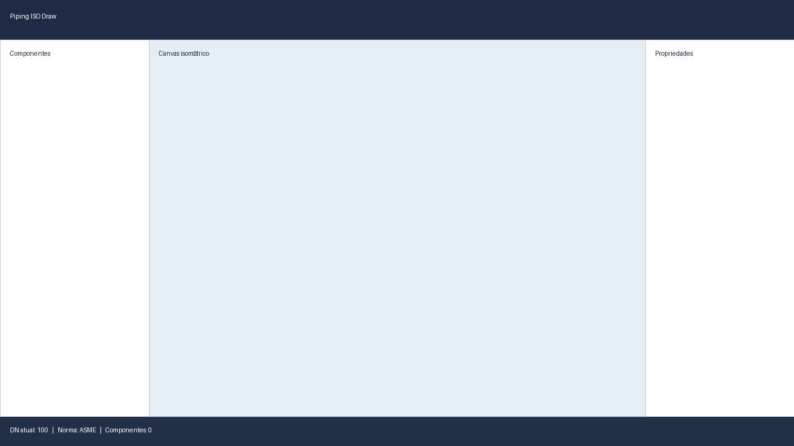

# Piping ISO Draw

Aplicativo Android nativo para desenho isométrico de tubulação industrial, seguindo as normas ASME B16.x e ISO 10628/15649. Este repositório estrutura o projeto com arquitetura Clean/MVVM e módulos Gradle separados conforme o prompt técnico.

## Estrutura de módulos

- **:app** — Activity principal, UI Compose e navegação
- **:core:domain** — Entidades, enums e interfaces de repositório
- **:core:data** — Room (SQLite), repositórios e DI
- **:core:standards** — Dados de normas (NPS/DN, take-out)
- **:feature:drawing** — Engine de projeção isométrica
- **:feature:components** — Catálogo de componentes (fase 1)
- **:feature:bom** — Geração de lista de materiais
- **:feature:export** — Contratos de exportação (PDF/DXF/PNG/SVG/CSV)
- **:feature:settings** — Configurações de projeto e title block

## Build rápido

```bash
./gradlew assembleDebug
```

## Screenshot (estrutura inicial)



## Testes

```bash
./gradlew test
```

## Arquitetura

- Kotlin 1.9+, Jetpack Compose, Room e Hilt
- Clean Architecture com módulos separados por camada e feature
- Engine de projeção isométrica isolada em módulo puro Kotlin para testes unitários

## Decisões técnicas

- **Módulos de feature como Kotlin/JVM**: as regras de cálculo (projeção, BOM, catálogo) são puras e testáveis sem dependências Android. A UI permanece em `:app` enquanto os módulos evoluem para componentes visuais conforme o roadmap.
- **Room síncrono no MVP**: DAOs com chamadas diretas simplificam o bootstrap inicial; migrações para coroutines/Flow ocorrerão quando a camada de UI estiver integrada.
- **UI inicial com layout adaptável**: a tela principal já contempla layout tablet/compact conforme a seção 9 do prompt, com painéis e canvas em placeholders.
